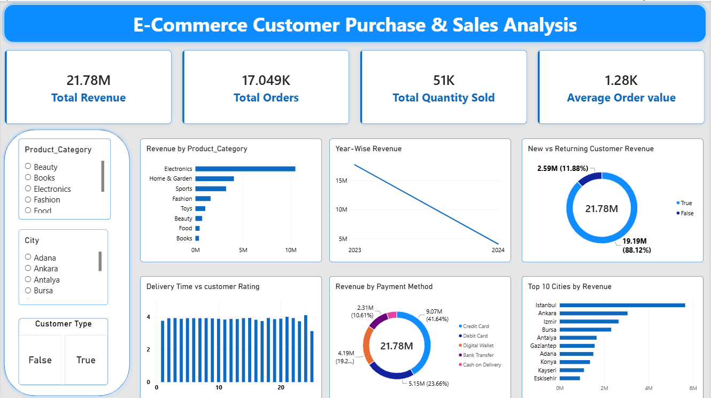

# E-Commerce Customer Purchase Behaviour & Sales Analysis

##  Project Overview

This project analyzes e-commerce customer purchase behavior and sales data to understand customer spending, product performance, revenue trends, and purchasing patterns.

The analysis was performed using **Excel, SQL, Python, and Power BI**.

##  Project Objectives

- Analyze customer purchasing behavior
- Identify top-performing product categories
- Understand new vs returning customer spending
- Analyze revenue by city and payment method
- Study the relationship between delivery time and customer ratings
- Create an interactive dashboard for business insights

##  Tools & Technologies

- **Excel** – Data exploration, Pivot Tables and Charts
- **SQL (MySQL)** – Business queries and data analysis
- **Python (Pandas)** – Data analysis and deeper insights
- **Power BI** – Interactive dashboard and visualization

##  Dataset

The dataset contains **17,049 records** and includes information such as:

- Order ID
- Customer ID
- Date
- Age
- Gender
- City
- Product Category
- Unit Price
- Quantity
- Discount Amount
- Total Amount
- Payment Method
- Device Type
- Session Duration
- Pages Viewed
- Is Returning Customer
- Delivery Time
- Customer Ratings

##  Analysis Performed

### Excel
- Created Pivot Tables
- Analyzed revenue, orders and quantity
- Created charts for important business trends

### SQL
Performed business analysis such as:
- Top spending customers
- Best-selling product categories
- New vs returning customer analysis
- Revenue by city
- Revenue by payment method
- Device-wise sales analysis
- Delivery time and customer rating analysis

### Python
Used Pandas for:
- Customer spending analysis
- Product category analysis
- City and payment analysis
- Discount and spending relationship
- Customer engagement analysis
- Age group and gender analysis
- Customer spending distribution

### Power BI
Created an interactive dashboard with:

- Total Revenue
- Total Orders
- Total Quantity Sold
- Average Order Value
- Revenue by Product Category
- Year-wise Revenue
- New vs Returning Customer Revenue
- Top 10 Cities by Revenue
- Revenue by Payment Method
- Delivery Time vs Customer Rating
- Interactive slicers for Product Category, City and Customer Type

##  Key Business Questions

1. Which customers spend the most?
2. Which product categories are purchased the most?
3. How does spending differ between new and returning customers?
4. Does discount have a relationship with customer spending?
5. Does customer engagement affect purchase value?
6. Which cities generate the most revenue?
7. Which payment methods are most commonly used?
8. Which device types generate higher revenue?
9. Does delivery time affect customer satisfaction?
10. Which customer groups have higher purchase value?

##  Project Outcome

This project helped identify important patterns in customer purchasing behavior, sales performance, revenue contribution, and customer satisfaction.

The Power BI dashboard provides an interactive way to explore these insights and support data-driven business decisions.

##  Future Scope

- Add customer segmentation
- Build sales forecasting models
- Add customer churn/retention analysis
- Use advanced machine learning techniques
- Automate dashboard data updates

## Dashboard

